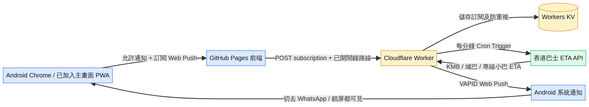

# BusPulse HK：Cloudflare 真正背景通知教學

呢份教學係畀 Android 使用者跟住做。完成後，BusPulse HK 會由 Cloudflare Worker 每分鐘查一次巴士到站資料；當你設定嘅巴士進入提醒時間，Android 系統會直接顯示通知。你可以切去 WhatsApp、YouTube，甚至鎖屏，仍然有機會收到通知。

> **先講清楚限制：** GitHub Pages 只負責顯示網站，唔可以自己每分鐘查資料。所以真正背景通知一定要加一個後端 Worker。Cloudflare 未登入你嘅帳戶之前，我唔會代你部署或接觸你嘅私鑰。

## 完成後會係咁運作



整個流程有五部分：手機 PWA 訂閱通知、GitHub Pages 傳送訂閱資料、Cloudflare Worker 每分鐘執行、Workers KV 儲存訂閱、Worker 用 VAPID Web Push 將通知送到 Android 系統。

## 你需要準備

| 項目 | 用途 |
|---|---|
| Cloudflare 免費帳戶 | 執行 Worker、Cron Trigger 及 KV |
| 一部電腦 | 第一次部署要使用終端機；之後 Android 只負責收通知 |
| Node.js 16.17 或以上 | 執行 Wrangler 部署工具 |
| BusPulse HK GitHub 專案 | 已經包含 Worker 程式 |
| 一對 VAPID key | 令 Web Push 伺服器可以安全識別自己 |

Cloudflare 官方文件要求 Wrangler 使用 Node.js 16.17 或以上版本。[1] 

## 第一部分：安裝 Node.js 及下載程式

### Windows

1. 開啟 [Node.js 官方網站](https://nodejs.org/)。
2. 下載 **LTS** 版本並安裝。
3. 安裝完成後，開啟 **PowerShell**。
4. 逐行貼上以下指令：

```powershell
node --version
npm --version
git clone https://github.com/cw91020251212/gang-baa-im-si-buspulse-hk.git
cd gang-baa-im-si-buspulse-hk\worker
npm install
```

如果 `node --version` 顯示 `v16.17.0` 或更高版本，就可以繼續。

### macOS / Linux

開啟 Terminal，逐行貼上：

```bash
node --version
npm --version
git clone https://github.com/cw91020251212/gang-baa-im-si-buspulse-hk.git
cd gang-baa-im-si-buspulse-hk/worker
npm install
```

## 第二部分：登入 Cloudflare

喺同一個終端機貼上：

```bash
npx wrangler login
```

瀏覽器會自動開啟 Cloudflare 授權頁面。按 **Allow / Authorize**。完成後返回終端機。

如果瀏覽器冇自動開啟，終端機通常會顯示一條網址；複製條網址，用瀏覽器打開並完成登入。

確認登入成功：

```bash
npx wrangler whoami
```

你應該見到自己嘅 Cloudflare 帳戶資料。唔好將登入 token、VAPID private key 或任何 secret 截圖公開。

## 第三部分：建立 Workers KV

Workers KV 係一個簡單嘅 key-value 儲存空間，用嚟保存手機嘅 Web Push 訂閱資料及「呢一班車已經通知過」嘅記錄。

### 方法 A：用終端機，最容易對接本專案

仍然喺 `worker` 資料夾內，貼上：

```bash
npx wrangler kv namespace create SUBSCRIPTIONS
```

Cloudflare 會輸出類似以下內容：

```text
Add the following to your configuration file:
[[kv_namespaces]]
binding = "SUBSCRIPTIONS"
id = "xxxxxxxxxxxxxxxxxxxxxxxxxxxxxxxx"
```

請複製輸出入面嘅 **id**。開啟專案內：

```text
worker/wrangler.toml
```

將以下兩行嘅 ID 換成你啱啱建立嗰個 ID：

```toml
[[kv_namespaces]]
binding = "SUBSCRIPTIONS"
id = "貼上你自己嘅 KV ID"
preview_id = "貼上你自己嘅 KV ID"
```

`binding` 必須保持 `SUBSCRIPTIONS`，因為 Worker 程式會使用 `env.SUBSCRIPTIONS`。Cloudflare 官方亦指出，KV binding 名稱要同 Worker 程式使用嘅環境變數一致。[2]

### 方法 B：用 Cloudflare Dashboard

如果你唔想用指令建立：

1. 開啟 [Cloudflare Dashboard](https://dash.cloudflare.com/)。
2. 左邊揀 **Workers & Pages**。
3. 開啟 **Workers KV**。
4. 按 **Create instance**。
5. 名稱輸入：`buspulse-subscriptions`。
6. 按 **Create**。
7. 之後仍然要將 namespace ID 填返入 `worker/wrangler.toml`。

Cloudflare 官方 Dashboard 流程係 **Workers KV → Create instance**；Worker 綁定則係 Worker 的 **Settings → Bindings → Add binding → KV namespace**。[2]

## 第四部分：生成 VAPID keys

VAPID key 一對兩條：

- **Public key**：可以放入前端設定及 Worker secret。
- **Private key**：只可以放入 Cloudflare Secret，絕對唔可以放 GitHub。

喺 `worker` 資料夾內執行：

```bash
npx web-push generate-vapid-keys
```

如果上面指令話搵唔到 `web-push`，先執行：

```bash
npx web-push generate-vapid-keys --json
```

你會得到類似：

```json
{
  "publicKey": "PUBLIC_KEY_HERE",
  "privateKey": "PRIVATE_KEY_HERE"
}
```

先將兩條 key 暫時複製到自己嘅私人筆記。**唔好貼俾任何人，亦唔好放入 GitHub。**

## 第五部分：部署 Worker

喺 `worker` 資料夾內執行：

```bash
npx wrangler deploy
```

第一次部署可能會問你 Worker 名稱及 `workers.dev` 子網域。一般直接接受預設值即可。

成功後會見到類似：

```text
Deployed buspulse-background-worker
https://buspulse-background-worker.YOUR-SUBDOMAIN.workers.dev
```

請完整複製呢條網址。呢條就係稍後要貼入 BusPulse HK 設定嘅 **背景推送伺服器網址**。

你可以先測試 Worker：

```bash
curl https://你的-worker-網址.workers.dev/health
```

應該會回覆：

```json
{"ok":true,"cron":"every minute"}
```

## 第六部分：加入三個 Worker Secrets

### 用終端機加入，推薦

逐條執行：

```bash
npx wrangler secret put VAPID_SUBJECT
```

輸入：

```text
mailto:你嘅電郵地址
```

再執行：

```bash
npx wrangler secret put VAPID_PUBLIC_KEY
```

貼上剛才生成嘅 **publicKey**。

最後：

```bash
npx wrangler secret put VAPID_PRIVATE_KEY
```

貼上剛才生成嘅 **privateKey**。

### 用 Dashboard 加入

1. 開啟 Cloudflare Dashboard。
2. 揀 **Workers & Pages**。
3. 揀 `buspulse-background-worker`。
4. 開啟 **Settings**。
5. 搵到 **Variables and Secrets**。
6. 按 **Add**。
7. Type 揀 **Secret**。
8. 依次加入以下三個名稱：

| Variable name | Value |
|---|---|
| `VAPID_SUBJECT` | `mailto:你嘅電郵地址` |
| `VAPID_PUBLIC_KEY` | 你生成嘅 public key |
| `VAPID_PRIVATE_KEY` | 你生成嘅 private key |

9. 按 **Deploy**。

Cloudflare 官方位置係 Worker 的 **Settings → Variables and Secrets → Add → Secret**，Secret 值之後會被隱藏。[3]

## 第七部分：檢查 Cron Trigger

本專案嘅 `worker/wrangler.toml` 已經設定：

```toml
[triggers]
crons = ["* * * * *"]
```

意思係 **每分鐘執行一次**。部署時 Wrangler 會一併設定 Cron Trigger。

如果你想喺 Dashboard 檢查：

1. Cloudflare Dashboard → **Workers & Pages**。
2. 揀 `buspulse-background-worker`。
3. 入 **Settings**。
4. 入 **Triggers**。
5. 睇 **Cron Triggers** 是否有 `* * * * *`。

Cloudflare 官方 Dashboard 位置係 **Workers & Pages → Worker → Settings → Triggers → Cron Triggers**。[4]

Cloudflare Cron 使用 UTC 時區；不過本專案係每分鐘執行一次，唔涉及指定某一個鐘頭，所以唔需要換算香港時間。

## 第八部分：將 Worker 接入 BusPulse HK

用 Android Chrome 開啟：

<https://cw91020251212.github.io/gang-baa-im-si-buspulse-hk/>

跟住做：

1. 先用 Chrome 的 **⋮ → 加入主畫面**。
2. 從手機主畫面開啟「港巴即時」。
3. 允許通知。
4. 加入至少一條巴士路線。
5. 撳嗰條路線嘅 **🔔 鬧鐘按鈕**。
6. 開啟「設定」。
7. 入「顯示與提醒設定」。
8. 喺 **背景推送伺服器網址** 貼上：

```text
https://你的-worker-網址.workers.dev
```

9. 撳 **開啟**。
10. 見到「已開啟真正背景提醒」就代表手機已經成功訂閱。

## 第九部分：用測試工具確認 Android 通知

1. 保持至少一條路線已經開啟 🔔。
2. 進入 App 設定。
3. 展開 **測試工具**。
4. 撳 **允許系統通知**。
5. 選擇 **15 秒後**。
6. 撳 **安排背景測試**。
7. 立即切去 WhatsApp 或按手機電源鍵鎖屏。
8. 15 秒後應該見到 BusPulse HK 系統通知。

呢個測試只確認 Android、PWA、Service Worker 同系統通知權限；真正巴士到站通知則由 Cloudflare Worker 每分鐘查 ETA 後發出。

## 第十部分：Android 必須檢查的設定

如果仍然冇通知，逐項檢查：

| 檢查位置 | 應有設定 |
|---|---|
| Android 設定 → 通知 → 港巴即時 | 允許通知 |
| Android 設定 → 電池 → 港巴即時 | 不受限制／允許背景活動 |
| Chrome 網站設定 → 通知 | 允許此網站通知 |
| BusPulse HK App | 必須由主畫面圖示開啟，而唔係只開普通瀏覽器分頁 |
| App 內設定 | 已填正確 Worker URL，並顯示「已開啟真正背景提醒」 |
| 路線卡 | 已開啟 🔔 鬧鐘 |

## 常見錯誤

### `401 Unauthorized` 或 `wrangler login` 失敗

重新執行：

```bash
npx wrangler login
npx wrangler whoami
```

確認登入嘅 Cloudflare 帳戶係你想用嗰個帳戶。

### `KV namespace not found`

你可能使用咗 repo 內原本示例嘅 KV ID。重新執行：

```bash
npx wrangler kv namespace create SUBSCRIPTIONS
```

再將新 ID 填入 `worker/wrangler.toml`，然後重新部署：

```bash
npx wrangler deploy
```

### App 顯示「讀取推送設定失敗」

先用瀏覽器開：

```text
https://你的-worker-網址.workers.dev/health
```

如果 `/health` 都開唔到，代表 Worker URL 錯、部署未完成，或者 Worker 名稱打錯。

### App 顯示「同步路線失敗（400）」

確認你至少有一條路線已開啟 🔔。Worker 只接受有開啟提醒嘅路線。

### 有測試通知，但冇真正到站通知

先睇 Cloudflare Worker 的 **Cron Events**。位置係：

**Workers & Pages → Worker → Settings → Trigger Events → View events**

Cloudflare 會喺呢度顯示最近嘅 Cron 執行記錄；官方指出，新 Worker 或改名後，歷史事件有時需要最多約 30 分鐘先出現。[4]

## 安全提醒

請永遠遵守以下三點：

1. **VAPID_PRIVATE_KEY 永遠唔可以放入 GitHub。**
2. 唔好將 Cloudflare API token、登入 token 或 secret 截圖貼到公開群組。
3. 如果 private key 不小心公開，立即重新生成一對 VAPID keys，並更新 `VAPID_PUBLIC_KEY` 及 `VAPID_PRIVATE_KEY`。

## 官方參考

[1]: https://developers.cloudflare.com/workers/get-started/guide/ "Cloudflare Workers CLI 入門及部署"
[2]: https://developers.cloudflare.com/kv/get-started/ "Cloudflare Workers KV 建立及綁定"
[3]: https://developers.cloudflare.com/workers/configuration/secrets/ "Cloudflare Workers Secrets"
[4]: https://developers.cloudflare.com/workers/configuration/cron-triggers/ "Cloudflare Workers Cron Triggers"
